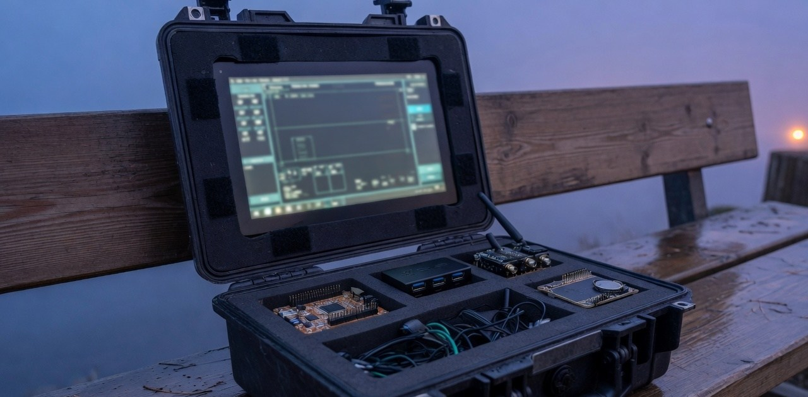

# RVN



**FIELD//OS** — the operating shell for an off-grid field cyberdeck.

RVN is the instrument an operator opens in the field: navigation, radio awareness, mesh, and the health of the machine, in one full-screen shell. It is built for a Raspberry Pi 5 in a hard case, and for days when the network is absent.

## Goal

A field computer that remains a complete instrument with nothing to connect to. The lid opens onto a shell that already knows where it is, what it can hear, who is on the mesh, and whether the kit itself is sound.

## Objectives

- Give the operator one surface for position, spectrum, mesh, and the host.
- Keep every transmit, scan, and shell action in the operator's hands.
- Stay up when a module is missing, unplugged, or unhealthy.
- Size power and endurance from the real kit, measured under load.
- Treat the cased Pi as the product. A desk window is how the shell is built.

## The tiles

Home is five tiles. Keys `1` through `5` open them. `Esc` or `0` returns home.

| Tile | Key | What it carries |
|------|-----|-----------------|
| **NAV** | 1 | Position · tracks · waypoints |
| **RADIO** | 2 | Spectrum · receive |
| **MESH** | 3 | Nodes · messages |
| **TERMINAL** | 4 | Operator shell |
| **SYSTEM** | 5 | Health · modules |

**NAV** holds the fix. A USB GNSS receiver fills coordinates, grid, speed, heading, and how fresh the last sentence is. The operator drops waypoints and can keep a track of the path walked. Offline maps are the direction this tile grows.

**RADIO** holds the band. Start receive on the attached SDR and the spectrum is plotted around the tuned center. Listening is the posture of this tile. It does not transmit.

**MESH** holds the other radios. A Meshtastic node enumerates, heard stations appear, and text arrives on its own. Sending is a separate armed act, and a line is kept only when the radio accepts it.

**TERMINAL** is the operator shell. A command runs because it was typed. The shell stays inside the instrument.

**SYSTEM** is the kit looking at itself. Processor, memory, storage, network, and the readiness of every module share one screen. Power figures land here once the case has been measured under load.

## Approach

The shell is a small set of instruments over a single source of truth. Hardware sits behind adapters, so a live module and a stand-in report the same status and the interface does not care which one is attached.

Each subsystem announces its own readiness. A missing radio leaves navigation alive. A quiet mesh leaves the spectrum alive. The shell degrades one instrument at a time.

Radio listening is the default posture. Transmission is a separate, armed act. The terminal runs only what the operator types. Nothing in the shell reaches outward unless that reach was asked for.

The case, the display, the hubs, and the modules are commissioned together. Current draw is measured before a battery is chosen, so the pack matches the kit that will actually be carried.

RVN is a native Rust shell. The interface is declared, the state is owned in one place, and the Pi build is the one that ships in the case.

## Install

The supported build is Linux, including Raspberry Pi OS. The same binary opens as a window on the desk and full-screen in the case.

Install a current stable Rust toolchain from [rustup](https://rustup.rs), then the libraries the shell links against:

```bash
sudo apt update
sudo apt install -y build-essential pkg-config libfontconfig1-dev libudev-dev libxkbcommon-dev
```

Clone and run:

```bash
git clone https://github.com/logsexe/rvn.git
cd rvn
cargo run
```

With the modules unplugged, the simulated kit is the same shell:

```bash
RVN_MOCK=1 cargo run
```

On the Pi, use those same commands after rustup and the packages above. USB GNSS, the SDR, and the Meshtastic radio attach through the hub. The shell listens for them when it starts. A missing module leaves its tile offline and the rest of the shell up.

## License

Apache-2.0
