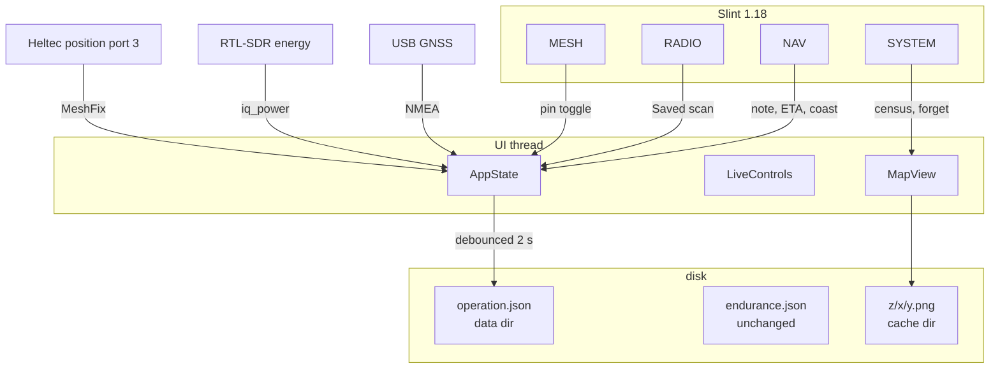
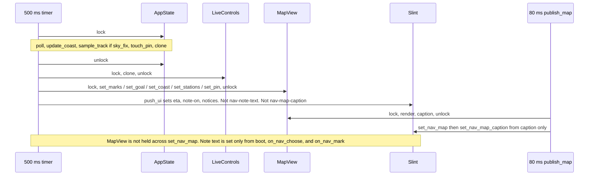
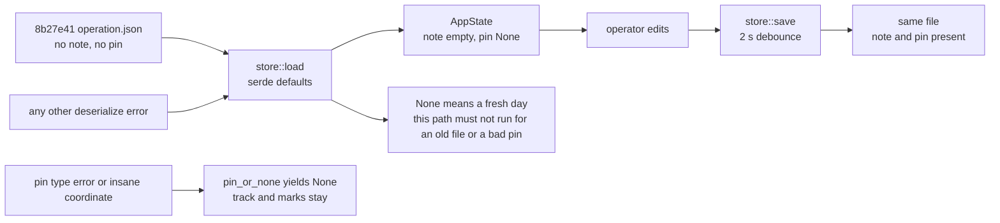

# Next field capabilities for FIELD//OS

| | |
|---|---|
| Author | _unassigned_ |
| Date | 2026-09-29 |
| Status | Draft |
| Product | FIELD//OS (RVN) 0.1.0, Apache-2.0 |
| Baseline | `8b27e41` — “Remember the operation, and add the eight register tools.” Branch `live-usb`. Tree clean. |
| Window | Preferred 800×480, minimum 640×400. Not a kiosk. |
| UI | Slint 1.18, `backend-winit`, `renderer-skia`. Native. No browser. |

This document designs the next wave only. It does not reopen the eight register items in `docs/REGISTER.md`. It does not change `Cargo.toml` features, and it is not an implementation.

---

## Overview

The shell on `8b27e41` already keeps a day on disk, guides the operator back to a mark, saves a small street-tile patch, plots heard mesh positions, remembers sixteen frequencies, raises session notices, dims the theme, and shows endurance only from a measured file. What it still cannot do, with the lid open and any of the three USB modules missing, is annotate a mark, say how long the walk back will take, keep a short honest line when the sky drops, tell the operator how much map cache is on the card, revisit the frequencies they already kept, or hold one mesh station on the map after the Heltec is unplugged.

This wave adds six capabilities, each a pull request that compiles and tests on its own:

1. A field note on a waypoint, recalled with the guide.
2. Straight-line time to the selected mark, shown only while the sky fix is moving.
3. A labeled coast that starts only on the sky-loss edge while TRACK is already on, at most 20 seconds or 80 metres measured from that edge, then a stop. The coast is not stored as GPS and does not move the fix dot.
4. A map-cache census and a two-step forget. Still no bulk download.
5. A receive-only energy pass over the saved bookmarks. No audio, no demodulator, no new channel list.
6. One pinned mesh station, keyed by the numeric node id, kept in `operation.json`, still drawn when the radio is gone.

An operation timeline was considered and cut. The mesh log and the waypoint list already survive reboot; a third history is the easy place to accidentally persist session notices. See Alternatives.

A file written by `8b27e41` must still load. New JSON fields use `#[serde(default)]`. `load` in `src/core/store.rs` turns any deserialize error into “no operation”, which would drop the track, the marks, and the mesh log together. That is the compatibility bar for this wave.

---

## Background & Motivation

### What the operator has today

Five tiles, keys `1`–`5`, `Esc` or `0` home. `AppState` in `src/core/state.rs` is the source of truth. Adapters are independent and fail soft: missing hardware is `Readiness::NotPresent`, never a panic. `RVN_MOCK=1` selects `MockAdapter`; otherwise `boot` in `src/adapters/mod.rs` starts `LivePlatform`. The UI thread polls every 500 ms and, while NAV is open, redraws the map every 80 ms.

| Already shipped | Where it lives | What this wave must not redo |
|---|---|---|
| Operation file | `src/core/store.rs` `Operation`, loaded in `src/main.rs`, debounced save ~2 s, save on exit | Do not add a second file for notes, pins, or bookmarks. Do not resume `tracking` after boot. |
| Guide | `AppState::choose_mark`, `goal`, `guide_text`; `geo::bearing_deg`, `range_text`; amber line from `MapView::set_goal` | Do not add a routing engine. |
| Area save | `MapView::area_plan` zoom 15, radius 2, 25 tiles, cap 64; paced fetcher, 600 ms, channel 80, UA `RVN/0.1 (field shell; https://github.com/logsexe/rvn)` | Do not bulk-download. A missing network still leaves the graticule. |
| Heard stations | `POSITION_APP` port 3 and `NodeInfo.position` in `src/adapters/proto.rs`; merge in `src/adapters/mesh.rs` so a later node-info without a fix does not clear lat/lon; 4-character bitmap label | Do not plot the own node. Do not decode other ports. |
| Bookmarks and waterfall | `keep_bookmark`, max 16, replace within 0.005 MHz; 36×48 waterfall, paused while `radio.scanning` | No audio, no transmit. |
| Home notices | Unread mesh, stale fix only while `latitude.is_some()` and `age_ms > 5_000`, module-removed only after it was present this session. After the GPS wipe the removed line replaces the stale line; they are not both shown | Notices stay in the timer closure. They are not written to disk. |
| Night | `Theme.night`, key `n`, home button, persisted | A focused note field must still be able to contain the letter n. |
| Endurance | `endurance.json` `{pack_wh, draw_w}`, hours = `pack_wh / draw_w`, else `—` | Do not invent a state of charge. Do not start the power bench. `docs/POWER-PLAN.md` stays the bench plan. |

`docs/ARCHITECTURE.md` still says real adapters are future work and that the next step is a full-screen kiosk. That file is stale. This design does not treat it as current and does not rewrite it.

### Pain on a walk

- `Waypoint` is `id`, `lat`, `lon`, `alt_m`, `marked_at`. The guide can walk the operator back to `WP-03` and cannot say why it was marked. `marked_at` is a clock string (`%H:%M:%S` from the mark callback), not a note.
- `guide_text` is distance and initial bearing. `GpsStatus` already carries `speed_kmh` and `course_deg`. `heading_display` already treats speed below 0.5 km/h as “not moving” and prints `—`. The guide never turns range and live speed into a time, so a stopped fix and a 5 km/h fix look the same.
- A sky loss is visible (home line `NAV · fix Ns` while `latitude.is_some()` and `age_ms > 5_000`, NAV age, readiness `Degraded` after 5 s). That age and readiness live in `GpsInner::publish`, which `GpsAdapter::snapshot` calls. There is no `GpsAdapter::publish`. The teal track simply stops when lat is missing. `sample_track` today records any lat/lon whose readiness is not `NotPresent`, including `GpsFix::DeadReckoning`. When the USB receiver disappears, `gps_loop` replaces `GpsInner` with the default, so lat, speed, and course are wiped on the next poll, and the home line is the removed notice rather than the stale-fix notice. The map dot is stickier than the status: `note_fix` is called whenever lat/lon are `Some`, and nothing clears `MapView.fix`. The last teal dot remains, with no label that says the sky is gone. This wave stops passing dead-reckoning and coast points into `sample_track` and `note_fix`.
- Tiles accumulate under `cache_dir()` (`$XDG_CACHE_HOME/rvn/map`, else `~/.cache/rvn/map`, else `%LOCALAPPDATA%\rvn\map`, else the relative directory `map-cache` when all three variables are unset) as `{z}/{x}/{y}.png`. SYSTEM shows root percent and free space. Nothing counts tiles, and nothing deletes them. The data directory (`store::data_dir`) is a different tree and holds `operation.json` and `endurance.json`. `cache_dir` is not reimplemented; forget and the census call the existing function.
- RADIO can sweep a public allocation (`scan_plan` in `src/core/bands.rs`) or ±15 MHz around the dial. The `_` arm of `scan_plan` is that ±15 MHz plan, labeled `This area`. Bookmarks tune one frequency at a time. There is no pass across the set the operator kept. `power_peaks` assumes a contiguous sweep: a point is kept when its power is `>=` the previous sample and `>` the next, and above the noise cut. It is not a strict greater-than on both neighbors. Bookmark frequencies are not neighbors in that sweep. Reusing `power_peaks` on them would hide a loud mark that sits between two other loud marks. Allocation scans keep `power_peaks`. The saved scan does not call it.
- `mesh_fixes` plots stations only while `MeshInner` is alive. `mesh_loop` assigns `MeshInner::fresh()` on disconnect, so every fix disappears when the Heltec drops. `MeshFix` is `{name, lat, lon}` and `name` is at most four glyphs (`draw_label` takes four characters, A–Z and 0–9). Short names collide. `Heard.id` is a display string (`!{num:08x}` via `node_label`, or the radio’s `!` user id) and `apply_payload` replaces it when a later node-info carries a different user id. The numeric node id in that same match is the stable key. The map cannot join a dot back to it today, and nothing is written to `Operation`. `MeshFix` is constructed in exactly two places: `mesh_fixes` and the mock literal.

### Constraints that bind every capability

- Crate is bin-only (`src/main.rs`). Tests are `cargo test`, not `cargo test --lib`, in the existing `#[cfg(test)]` modules. No hardware, no serial port, no RTL-SDR, no HTTP in tests.
- Never hold `AppState` and `LiveControls` together. Never hold the `MapView` mutex across `set_nav_map`. The 500 ms timer and the 80 ms map timer both run on the Slint UI thread.
- Do not write `mesh-draft`, terminal text, or `radio-mhz` from the ticker while those controls are being edited. `sync_ui` already skips `radio_mhz` when `radio-dragging` is set, and it never assigns `mesh-draft` or `term-input`. A note field joins that list.
- Slint 1.18: declare helpers before use; no `viewport-height`; `TextInput` has no placeholder; padding sits on layouts, not on `Rectangle`; theme colors stay out-properties driven by `Theme.night`. Rust sets night through the window property. Do not force kiosk or a single window size.
- Subsystems stay independent. A missing GNSS, NESDR, or Heltec leaves its own tile quiet.
- OSM tiles: the visible view, plus an operator-requested area of at most 64 tiles. User-Agent string stays as it is.
- Radio stays 24–1700 MHz, receive-only, FFT 1024 into 48 bins for the spectrum plot, sample rate 2.048 MHz. Sweep energy is `iq_power` over that tuner window, not a channel demodulator. The public Australian notes in `au_notes` stay allocation names. No police, fire, or ambulance channel list. No AM demod settings. No Bluetooth GPS. No GPL `meshtastic` crate. The hand-rolled codec in `src/adapters/proto.rs` stays the only mesh parser. MESH TX stays disarmed until ARM TX. A send is logged only when `platform.send_mesh_text` returns true. Broadcast `0xFFFFFFFF`, hop 3, unchanged.
- `AppEvent` in `src/core/events.rs` is unused by the shell. This wave does not revive it. New behavior is an `AppState` method plus a Slint callback, which is the pattern `8b27e41` already uses.

---

## Goals & Non-Goals

### Goals

- Six operator-visible capabilities, ordered so each pull request merges on its own and passes `cargo test` without hardware.
- Extend `AppState`, `operation.json`, and the existing NAV, RADIO, MESH, and SYSTEM surfaces. No sixth tile. Keys `1`–`5` stay.
- New persisted fields are optional on read. An `8b27e41` operation file loads, including waypoints that have no `note`.
- Fail-soft: each capability does nothing visible, or shows a blank / a refusal string, when its module or its input is missing. It does not crash and it does not block the other tiles.
- Coast and ETA are explicit about which numbers are measured and which are arithmetic.

### Non-goals

- Transmit audio, any demodulator, AM settings, a service-channel list, a world tile download, an invented battery percent, Bluetooth GPS, a GPL Meshtastic dependency, a forced kiosk, a window lock.
- Rewriting `README.md` or `docs/ARCHITECTURE.md`. A later implementation PR may add a short paragraph to `docs/REGISTER.md`; this design does not do that.
- Resuming TRACK after reboot. Changing the track spacing (8 m) or the cap (1 500), or the waypoint list window (40 rows). `sample_track` does gain a `sky_fix` gate so dead reckoning is not stored. That is a predicate, not a new sampler.
- Per-point track timestamps, a route, off-track alarms, or more than one mesh pin.
- An operation timeline (cut; see Alternatives).
- Auto-evicting map tiles. Forget is an operator act.
- Looping the saved scan. One pass, then the dial returns to `SweepRun.return_mhz` as it does today.
- Requesting positions from the mesh, or sending anything new. The pin only stores a position the adapter has already decoded.
- The power bench (`docs/POWER-PLAN.md`, P0–P11), Picade audio, the AI HAT+, and any change to mock battery percent. `MockAdapter` already fills `percent: Some(87)` after 9 s. That remains a desk stand-in. Live SYSTEM charge stays `—` until a real gauge exists.
- Terminal commands for these features. The lid is the touch surface. The destructive-command refusal in the terminal stays as it is.

---

## Proposed Design



The 500 ms timer stays the only place that copies adapter snapshots into `AppState`. Order under that lock is `poll`, then `update_coast`, then `sample_track` (only when `sky_fix` is true), then `touch_pin`, then clone. The lock is dropped before `push_ui` and before `set_nav_map`. `push_ui` may set `nav-eta`, `nav-note-on`, and `mesh-notice`. It does not set `nav-note-text` and it does not set `nav-map-caption`. The 80 ms map timer does not lock `AppState`. It is the only writer of `nav-map-caption`, via `publish_map` reading `MapView::caption()`. Coast geometry steps at 2 Hz, which is about 0.7 m at a walking pace. That is enough. Putting coast math on the 80 ms timer would create a second lock order for no visible gain. The caption text is not coast math; it is a string `caption()` builds from coast state the 500 ms tick already stored.



Draw order in `MapView::draw`, bottom to top: fill, graticule, tiles, teal track, coast segment, amber goal line, sky-blue live stations, pin ring, amber waypoint dots, teal fix dot. Each new layer is its own function so the coast PR and the pin PR do not rewrite each other.

### 1. Field note on a waypoint

**Operator control.** MARK still requires a sky position, as `mark_waypoint` does today (`NO FIX` otherwise). MARK also selects the new id, so the note field opens on the point just dropped. The existing tap-to-select / tap-again-to-clear behavior of `choose_mark` is unchanged. The note editor is a single `TextInput` directly under the guide, visible only while `selected_mark` is non-empty. There is no placeholder. A `NOTE` label sits on the layout beside the field. Clearing the selection hides the field and does not delete the note.

The names are split. A callback is UI→Rust. A property set from Rust is Rust→UI. One name is not both.

| Name | Direction | Who writes it |
|---|---|---|
| `nav-note-edited(string)` | UI→Rust callback | The `TextInput` `edited` handler. Rust calls `set_mark_note`. |
| `nav-note-text` | Rust→UI property | Boot, `on_nav_choose`, and `on_nav_mark` only. Never `sync_ui`. Never the 500 ms timer. |
| `nav-note-on` | Rust→UI bool | `sync_ui`, from `!selected_mark.is_empty()`. |

`NavSurface` does not have these today. PR 1 adds `in property <string> note-text`, `in property <bool> note-on`, and `callback note-edited(string)` on `NavSurface`, and threads them from `AppWindow`. The `TextInput` does not use `text <=> nav-note-text`. That two-way binding is what the bookmark field uses (`text <=> root.mark-name`), and it is safe there only because Rust never assigns `radio-mark-name` from the ticker. A `<=>` plus any later tick that set the property would move the cursor. The input takes the operator’s edits locally. A `changed note-text` handler on `NavSurface` assigns `field.text = note-text` when boot, choose, or mark pushes a new string. `edited` calls `note-edited`. The map-drag path does not write either property.

Typing commits through `nav-note-edited` to `AppState::set_mark_note`. Rust keeps at most 80 Unicode scalar values, strips `\n` and `\r`, and ignores the edit when no mark is selected. The 2 s debounced save writes the waypoint with the rest of the operation. The operator does not press a separate save key.

Recall is the guide block: `guide_text` stays the numeric line (`WP-01  840 m  045°`, plus the ETA suffix from capability 2 when that PR has merged). The note text in the field is the recall. The waypoint row stays 36 px. `WaypointRow` gains `note`, which is display text in the list model, not the editor. Today `WaypointLine` puts the id in a `Text` with `min-width: 52px` and no elide, then a stretch `Rectangle`, then `marked`. Replacing that id `Text` with `WP-01  creek gate` would collide with the clock. The id-and-note `Text` gets `horizontal-stretch: 1` and `overflow: elide`. `marked` stays on the right. `coords` stays on the second line, unchanged. The full 80 characters are only in the editor.

**Why the ticker must not push the text.** `sync_ui` runs every 500 ms and may set `nav-note-on` only. It must not call `set_nav_note_text`. Boot, `on_nav_choose`, and `on_nav_mark` are the only callers. The 500 ms sequence does not push the note string on selection change either; those three sites do, because they already run at the moment the selection changes.

**Night key.** `ui/app.slint` accepts `n` / `N` on the shell `FocusScope` unless `active-surface == 3`. A focused `TextInput` is expected to take character keys before that handler, which is why the radio name field can contain `n` today. The note field depends on that. If a device build shows `n` toggling night while the note is focused, the note surface sets `note-focused` and the shell handler returns `reject` for character keys in that case, the same shape as the terminal exception. That is a fallback, not a new shortcut.

**Fail-soft.** No selected mark: the field is hidden, `set_mark_note` returns false. No GPS: an already loaded mark can still be annotated; MARK itself still refuses. A note longer than 80 is truncated, not rejected with a dialog. Disk save failure stays the existing `store::save` bool; the note remains in memory and the next debounce retries. Empty note is the default and is what an old waypoint becomes.

**State and disk.** `Waypoint.note: String`, `#[serde(default)]`. Not a separate file. `operation_of` copies `waypoints` by clone, so the field rides along once it is on the struct. Boot already copies `op.waypoints` onto `AppState`. `selected_mark` is already persisted, so a note on the selected mark is on screen after reboot without resuming TRACK.

**Surface.** `ui/nav.slint` `NavSurface`, in the right-hand column, between the guide `Text` and the notice `Text`. `ui/models.slint` `WaypointRow`. `ui/app.slint` holds `nav-note-text`, `nav-note-on`, and callback `nav-note-edited(string)`. No new theme color. Padding on the row layout, not on a `Rectangle`.

**Test, no hardware.** In `src/core/state.rs`: mark two points, `set_mark_note("creek gate")` on the selected one, `choose_mark` shows that id from `guide_text`, a second `choose_mark` clears the guide, and the note is still on the waypoint. A note of 90 characters plus a newline is stored as 80 characters with no newline. `set_mark_note` with an empty `selected_mark` changes nothing. In `src/core/store.rs`: a JSON object shaped like `8b27e41`, with a waypoint that has no `note` key, loads; `note` is `""`; the track and the bookmark survive. Round-trip a note and read it back. Do not log the note body.

### 2. Time to the selected mark while moving

**Operator control.** No new button. Selecting a mark already asks for the guide. The time appears on that same line and disappears when the operator clears the mark, when the fix is not moving, or when the sky fix is not live. Stopped is not shown as `∞` or as `HOLD`. The line simply has no time, which matches `heading_display` printing `—` below 0.5 km/h.

**Definition of a live sky fix.** Used by this capability and by the coast:

```rust
fn sky_fix(gps: &GpsStatus) -> bool {
    matches!(gps.fix, GpsFix::Fix2D | GpsFix::Fix3D)
        && gps.readiness != Readiness::NotPresent
        && gps.latitude.is_some()
        && gps.longitude.is_some()
        && gps.age_ms.is_some_and(|age| age <= 5_000)
}
```

`GpsFix::DeadReckoning` is the receiver’s own quality flag (`as_display` already prints `DR`). It is not a sky fix. This wave does not estimate time from it.

**Arithmetic.** Straight-line range from `geo::haversine_m` divided by live `speed_kmh`. The result is the time to cover that range at the current speed. It is not the time along the current course, and it is not the time along the walked track. Bearing stays the initial great-circle bearing already produced by `geo::bearing_deg`.

```rust
fn eta_text(metres: f64, speed_kmh: f32) -> String {
    let secs = metres / (f64::from(speed_kmh) * 1000.0 / 3600.0);
    if secs < 90.0 {
        format!("{:.0} s", secs.max(1.0))
    } else if secs < 3_600.0 {
        format!("{:.0} min", (secs / 60.0).round())
    } else {
        format!("{:.1} h", secs / 3600.0)
    }
}
```

`AppState::eta_text` returns `""` unless a goal exists, `sky_fix` is true, and `speed_kmh` is at least 0.5. Otherwise it returns the formatted time. One kilometre at 3.6 km/h is 1000 s, which rounds to `17 min`.

The Slint guide line is `eta == "" ? guide : guide + "  " + eta`. That suffix is a separate property `nav-eta`, set from `sync_ui`, so the note PR and this PR do not edit the same Rust format string. The guide `Text` is the only vertical space used. Nothing new at 640×400.

**Fail-soft.** No mark, no lat, `NotPresent`, age over 5 s, fix `None` or `DR`, or speed under 0.5: `nav-eta` is `""`. A stale GPS status that still holds the last `speed_kmh` must not be used. The gate is `sky_fix`, not “the option is `Some`”. GNSS unplugged: the existing `guide_text` is already empty because readiness is `NotPresent`. ETA stays empty. No network. No disk.

**State and disk.** Derived. Not a field on `Operation`. Not part of `operation_of`.

**Surface.** The existing guide `Text` in `ui/nav.slint`. Property on `ui/app.slint`. No new callback.

**Test, no hardware.** Build a fix at `(-27.47, 153.02)`, select a mark 1000 m north, speed 3.6 km/h, age 400 ms, fix `Fix3D`, readiness `Ready`. `eta_text` is `17 min`. Speed 0.4 km/h, speed `None`, age 6_000 ms, fix `DeadReckoning`, and readiness `NotPresent` each yield `""`. `guide_text` is unchanged and still starts with the waypoint id when the lat is present. `sample_track` is not involved.

### 3. Labeled coast after the sky fix goes stale

**Operator control.** A coast can start only on the tick that transitions from `sky_fix` to not, and only if `tracking` is already true on that tick. TRACK is the existing “draw my path” control. There is no COAST button. The NAV column does not have room, and a line that appears when the operator did not ask for a path would violate explicit control. Starting TRACK still clears the stored track, as it does today; this wave does not change that.

STOP (`toggle_track` turning tracking off) clears the segment and sets `gap_open`, so pressing TRACK again during the same outage does not start another interval. The track clear on the way back to on still happens. That second TRACK is not a new sky-loss edge.

One coast interval per sky-loss edge. The edge flag is consumed even when no line is drawn. When the sky returns, the flag clears and a later loss may coast again. When the cap is hit, the line is removed and is not restarted while the sky is still gone.

**When it starts.** On the 500 ms tick, after `platform.poll()` and before `sample_track`. `update_coast` is the only thing that decides. `sample_track` does not run on a non-sky fix, including dead reckoning.

`GoodFix` stores `at_ms`, the monotonic time of that sky sample. `Coast` stores `lost_at_ms`, the monotonic time of the sky-loss edge, not the time a later TRACK press decided to draw. `gap_open` is true for the whole current non-sky stretch once the edge has been seen.

1. If `sky_fix`, replace `last_good` as a whole sample: lat, lon, course, speed, `at_ms = now_ms`, and `projectable = speed_kmh >= 1.0 && course_deg.is_some()`. Clear the coast. Set `gap_open` false. If `nav_notice` is `COAST` or `COAST ENDED`, clear it. Do not record a coast point into `track`.
2. If not `sky_fix` and `gap_open` is false, this tick is the edge. Set `gap_open` true before any other decision, including when speed is below 1.0 km/h, course is missing, or TRACK is off. A later TRACK cannot invent a coast from this gap.
3. On that same edge, start a coast only when all of these hold: `tracking` is already true, `last_good.projectable` is true, and `now_ms.saturating_sub(last_good.at_ms) <= 20_000`. The segment starts at that sample’s lat/lon along its course and speed. `Coast.lost_at_ms` is `now_ms`, the edge, not `last_good.at_ms` and not a later start. `nav_notice` becomes `COAST`.
4. If the edge fails those checks, draw nothing. A quality-0 stretch or a dead-reckoning stretch that begins while TRACK is off, or a sample that is already older than 20 s because the UI thread stalled, does not become a coast when the operator later presses TRACK. `GpsInner::publish` leaves readiness `Ready` when sentences are fresh but the fix is not 2D/3D, and the TRACK button stays enabled for `readiness == "ok"`. The edge flag is what stops that button from projecting a course that is minutes old.
5. While a coast exists, elapsed time is `now_ms - lost_at_ms`. That is the 20 s cap. It is not measured from `last_good.at_ms` and not from a `started_ms` recorded when drawing happened to begin. Distance is `speed_kmh / 3.6 * elapsed_s`. When elapsed passes 20 s or the unclamped distance would pass 80 m, clear the coast and set `nav_notice` to `COAST ENDED`. The line does not freeze at the cap.
6. `GpsFix::DeadReckoning` is not `sky_fix`, so it does not update `last_good` and does not extend a coast. It also does not enter `sample_track` or `note_fix`. The NAV badge can still say `DR`. The teal dot, the followed camera, and `operation.json`’s track must not.

`last_good` lives on `AppState`, `#[serde(skip)]`, so the USB wipe in `gps_loop` does not erase the last kinematics. The UI thread copies them on the sky ticks before a later poll replaces the snapshot. Boot does not synthesize a `last_good`. `gap_open` starts false; the first non-sky tick with no prior sky sample sets it and does not coast, because `last_good` is `None`. A file from disk has a track and no coast.

**How far.** Caps, whichever comes first:

| Cap | Value | Why |
|---|---|---|
| Time | 20_000 ms | A short labeled gap, not a navigator. |
| Distance | 80 m | Stops a fast estimate early. |

| Speed | Motion in 20 s | What binds |
|---|---|---|
| 1.0 km/h | 5.6 m | time |
| 5 km/h walk | 28 m | time |
| 30 km/h | 167 m unconstrained | 80 m at about 9.6 s |
| 60 km/h | 333 m unconstrained | 80 m at about 4.8 s |

```rust
pub fn destination(lat: f64, lon: f64, bearing_deg: f64, metres: f64) -> (f64, f64)
```

in `src/core/geo.rs`. Spherical destination on the same 6_371_000 m radius as `haversine_m`. Longitude wrapped into −180..180. Elapsed for both caps is `now_ms - lost_at_ms`.

**What it must not do.**

- Must not push the shell’s projected point, or a receiver dead-reckoning coordinate, into `AppState.track` or `MapView.track`. `sample_track` keeps the 8 m gate and the 1 500 cap, and it returns immediately unless `sky_fix` is true. `apply_gga` still maps quality 6 to `GpsFix::DeadReckoning` and still writes lat/lon on `NmeaState`. That coordinate is the receiver’s estimate. It is not a sky fix, so it is not a track point.
- Must not call `note_fix` with a coast point or a dead-reckoning point. The 500 ms timer calls `note_fix` only with `fix_for_map(gps)`, which returns `Some((lat, lon))` only when `sky_fix` is true. Otherwise it does not call `note_fix`. The teal dot stays where the last sky fix put it. That is the same stickiness the map already has after unplug, because nothing clears `MapView.fix`. `note_fix` moves the camera when `follow` is on, so a DR coordinate must not reach it. The NAV badge can say `DR` or `OFFLINE`. The dot is not that badge.
- Must not follow the camera to the projection or to DR. Follow keeps moving only while `note_fix` is still being called with sky fixes.
- Must not write coast fields into `Operation`. A reboot does not resume a coast, just as it does not resume TRACK.
- Must not be drawn in the goal-line amber `(251, 191, 36)` or the track teal `(45, 212, 191)`. The coast segment is `(180, 80, 40)`. The far end is tagged `CST` by a small variant of `draw_label` that takes a color. `draw_label` itself stays four sky-blue glyphs for live stations. `CST` fits the four-glyph cap; the words live in the caption, not in the bitmap.

**Caption owner.** `publish_map` in `src/main.rs` runs on the 80 ms timer whenever NAV is open, and whenever a hone is animating, and it always assigns `nav-map-caption` from `MapView::caption()`. That function today returns `Following · zoom N`, `Looking around · zoom N`, or `Waiting for a sky fix · zoom N`, plus ` · loading roads` when `missing > 0`. A 500 ms write of `COAST 12s · not a fix` would last until the next map frame and then disappear. The 500 ms tick must not call `set_nav_map_caption`.

`MapView::set_coast` stores the segment and the remaining whole seconds (`remain_s`), computed on the 500 ms tick as `20 - elapsed`. `caption()` is the only builder:

- No coast: the existing sentence, including ` · loading roads` when `missing > 0`.
- Coast stored: `COAST {remain_s}s · not a fix · zoom N`, and if `missing > 0` still append ` · loading roads`. The substring `not a fix` is mandatory. Zoom stays in the same string. `loading roads` is not dropped for the interval.

`publish_map` keeps the assignment it already has. PR 3 changes `caption()`, `set_coast`, and `publish_map` only if a comment is needed to say it is the sole writer. It does not add a second writer.

`nav_notice` is a separate line in `ui/nav.slint`, and that line prefers `notice` over the tracking sentence, so a stale `COAST` would hide `TRACKING` until something else overwrites it.

- Sky returns: clear `COAST` and `COAST ENDED`.
- STOP while the notice is `COAST`: clear the segment, consume the gap, and clear the notice. Do not leave `COAST` up.
- Cap hit: set `COAST ENDED`. Leave it until the next sky fix, or until the next NAV operator action (mark, track toggle, copy, choose, save area), whichever comes first. Those actions already set their own notice, except choose, which clears `COAST ENDED` if that is the current notice and does not invent a new one. The ticker does not clear `COAST ENDED` by itself while the sky is still gone.

**Fail-soft.** No GNSS this session: `last_good` is `None`, the first non-sky tick consumes the gap, no coast, no notice beyond the existing offline tile. GNSS linked but never a 2D/3D fix: no coast. Tracking off at the edge: gap consumed, no coast. Speed or course missing at the edge: gap consumed, no coast. Sample older than 20 s at the edge: no coast. The home stale line (`NAV · fix Ns`) still comes from the timer closure, only while `latitude.is_some()` and `age_ms > 5_000`, and is not suppressed, not persisted, and not mixed into `caption()`. After the receiver is wiped, that line is the removed notice, not both.

**State and disk.** Session-only on `AppState`:

```rust
struct GoodFix {
    lat: f64,
    lon: f64,
    course_deg: f32,
    speed_kmh: f32,
    projectable: bool,
    at_ms: u64,
}

struct Coast {
    from_lat: f64,
    from_lon: f64,
    course_deg: f32,
    speed_kmh: f32,
    lost_at_ms: u64,
}
```

`gap_open: bool` sits beside them. `update_coast(&mut self, now_ms: u64)` takes a millisecond clock so tests do not sleep. `main` passes a monotonic clock. The structs are `#[serde(skip)]` and default to `None`. `AppState` is `Serialize` today even though the file format is `Operation`; skip keeps a coast from becoming part of any future dump of `AppState`.

**Surface.** No new control. The map image is unchanged as a widget. `nav-map-caption` is written only in `publish_map`. `nav_notice` carries `COAST` / `COAST ENDED` under the rules above and is not persisted.

**Test, no hardware.** `destination` of 1000 m at bearing 0 from `(-27.47, 153.02)` moves latitude by about 0.009 degrees and leaves longitude within 5 m. Coast tests drive `update_coast` with an explicit `now_ms`:

- A projectable sky tick at t = 0, tracking already on, then a non-sky tick at t = 500: a coast exists, `lost_at_ms` is 500, and the segment end is the origin at elapsed 0.
- At t = 10_500 and 3.6 km/h the end is about 10 m out and the coast is still `Some`. The 20 s are counted from 500, not from t = 0.
- At t = 21_000 the coast is `None` and the notice is `COAST ENDED`.
- At 60 km/h the coast is `None` once 80 m would be crossed (5 s from `lost_at_ms` is enough).
- A second non-sky tick does not start another coast.
- Sky at t = 0 with tracking off, non-sky at t = 500 (gap consumed, no coast), then `toggle_track` on and another non-sky tick: still no coast. `track` was cleared by the existing TRACK-on behavior; that is not a coast.
- STOP during a coast clears the segment, sets `gap_open`, clears `COAST`, and a later TRACK in the same outage does not coast.
- `sky_fix` true clears the coast and clears `COAST` and `COAST ENDED`.
- A `DeadReckoning` snapshot whose lat has moved leaves `track.len()` unchanged. `fix_for_map` returns `None` for that snapshot and for age 6_000 ms, and `Some` for a 2D/3D fix at age 400 ms. A `MapView` that was `note_fix`’d at the sky point keeps that fix when `note_fix` is not called again.
- `MapView::caption` with a stored coast contains `not a fix` and, when `missing > 0`, also contains `loading`.

`RVN_MOCK=1` keeps `age_ms: Some(400)` after 3 s, so the desk mock will not show a coast. That is accepted. The test is the proof, not the mock.

### 4. Map cache census and forget

**Operator control.** The census and the button are a single 32 px row directly under the SYSTEM title and above the two columns. `SystemSurface` does not scroll. The left column is a section label, COMPUTE (four 22 px metrics), POWER (five metrics plus the endurance hint), then `STORAGE / NET`. Card padding is 16 px and `TopBar` is 48 px inside a 480 px window, so COMPUTE plus POWER already fill the column at 800×480. `STORAGE / NET` is below the window before a `MAP` metric is added, and it is further gone at 640×400. A two-step delete on that card is not a control the operator can reach. Do not put FORGET there, and do not put it below POWER.

The row reads `MAP`, then the census, then a button. The button label is the property `sys-forget-label`: `FORGET`, then `CONFIRM`, then `FORGETTING` while the worker runs, then `FORGET` again. The first press arms it for 5 s. A second press before that starts the delete. Expiry on the 500 ms tick reverts `CONFIRM` to `FORGET`. Arming is an `Rc<Cell<Option<Instant>>>` shared by `on_map_forget` and the timer. Both run on the UI thread. It is not closed over inside the timer alone, and it is not a field on `AppState`, so it cannot persist. One tap does not delete. The button is not on the NAV map. `S` stays “save this area”. A forget control beside `S` on a 7-inch touch screen is a mis-tap away from wiping the cache. The desk pass for this PR opens SYSTEM at 800×480 and at 640×400 and checks that the row is on screen without scrolling. `STORAGE / NET` stays root, free, and iface.

**Census.**

```rust
struct CacheCensus {
    files: u32,
    bytes: u64,
    truncated: bool,
}

fn count_cache(dir: &Path, cap: usize) -> CacheCensus
```

Walk `{z}/{x}/{y}.png` only. `cap` is 20_000. A truncated walk displays `20000+ tiles` rather than blocking. Other files are ignored. A missing directory is `0 tiles`, not an error.

The walk does not run inside `sync_ui`. A `rvn-map-count` thread runs at most once every 10 s. The UI thread only reads the last `CacheCensus` behind a mutex. It never joins a worker inside the Slint callback. Census zero is published only after `forget_cache` returns true, not before.

Display: `128 tiles · 3 MB`, or `0 tiles`, or `20000+ tiles · 480 MB`. Bytes in KiB under 1 MB, else MB with one decimal. This is cache size, not the SYSTEM `FREE` figure, which stays the host volume.

**Forget.**

```rust
fn forget_cache(dir: &Path) -> bool
```

`remove_dir_all` on that directory only, then recreate it empty. `dir` is always the existing `cache_dir()`, including its `map-cache` fallback. No operator-typed path. `operation.json` and `endurance.json` live under `store::data_dir` and are not inside this tree. The test places a sentinel file next to a temp cache and asserts the sentinel remains.

The worker is the only mutator of the directory. CONFIRM does not clear `tiles`, does not bump the epoch, and does not publish `0 tiles`. It sets `sys-forget-label` to `FORGETTING` and sends the path to the worker.

When the worker’s bool reaches the UI thread (a channel the 500 ms tick polls; the callback does not join):

- `true`: increment the epoch, clear `tiles` and `pending`, publish census `0 tiles`, set the label back to `FORGET`.
- `false`: leave `tiles`, `pending`, and the epoch as they were, set the metric to `CACHE KEPT`, set the label back to `FORGET`.

`MapView::finish_forget(&mut self, ok: bool)` is that branch. `fetch_loop` reads the epoch before the HTTP call and again before `fs::write`. A mismatch skips the write. The epoch moves only on success, so a failed delete does not discard in-flight tiles that the disk still holds. A fetch that already passed the pre-write check can still recreate one file after a successful delete; the next census counts it. That one file is not a reason to clear memory before the bool is known. Forget does not call `save_area`.

Visible tiles may refill after a successful clear. That refill is the existing policy: `consider` budgets 4 tiles per `enqueue`, the channel holds 80, the fetcher sleeps 600 ms, one tile at a time, and only for the view on screen. A missing network leaves the graticule, as it does today. The 120-tile memory trim in `enqueue` is unchanged.

**Fail-soft.** Missing cache: census `0 tiles`, `forget_cache` returns success, and only then does the metric read `0 tiles`. Permission error: `forget_cache` returns false, the in-memory tile map is unchanged, the metric reads `CACHE KEPT`, and `tracing` records the error. No panic. The map and the metric agree because memory is cleared only on the success path. Offline is not an error. Counting a huge tree stops at 20_000 entries.

**State and disk.** Not in `operation.json`. Cache directory only. A `Mutex<CacheCensus>` next to the map in `main`, plus the shared arming cell.

**Surface.** `ui/system.slint`, the row under the title, declared with a local button above `SystemSurface` (helpers before use). Do not import NAV’s `ActionButton`. `ui/app.slint` gains `sys-map-cache`, `sys-forget-label`, and callback `map-forget`. The census text uses the existing `Metric` height of 22 px inside the 32 px row.

**Test, no hardware.** Under `std::env::temp_dir()`, write three small `.png` files in `z/x/y` form and one unrelated file. `count_cache` returns 3 and the byte sum of the pngs. `forget_cache` removes the pngs and leaves the unrelated file. A second count is 0. A missing directory counts as 0. A pure `fn write_allowed(started_epoch, current_epoch) -> bool` is false when they differ. Inside `mapview.rs`, seed one in-memory tile, call `finish_forget(false)`, and assert the tile and the epoch are unchanged. `finish_forget(true)` clears the tile and bumps the epoch. Tests pass a temp `Path` into `count_cache` and `forget_cache`. They do not call `cache_dir()`, which would touch the developer’s real cache. `MapView::offline()` stays the way tests build a view with no fetcher.

Rough size: a street PNG is on the order of 10–40 KB. An AREA save is 25 tiles, a few hundred kilobytes to about a megabyte. A day of panning at zoom 15 is hundreds of tiles, typically a few megabytes to a few tens of megabytes. The 20_000 cap is a safety stop, not an expected walk.

### 5. Saved-frequency energy scan

**What it measures.** The same quantity `sweep_step` already records, in the same order: `set_center_freq`, `reset_buffer`, sleep 18 ms, a discarded `read_sync`, then the `read_sync` whose buffer is passed to `iq_power`. Do not settle before `reset_buffer`, and do not measure the discarded read. Call `iq_power`. Do not reimplement RMS on the raw unsigned bytes; `iq_power` recenters each sample on 127.5 before the root-mean-square. The tuner sample rate is 2.048 MHz (`SAMPLE_RATE` in `src/adapters/sdr.rs`). This is the energy in a window about 2 MHz wide centered on the bookmark, not a channel bandwidth and not a demodulated audio power. Two bookmarks closer than about 2 MHz share most of that window. The shell does not narrow the window, does not run the 1024-point FFT for this pass, and does not interpret modulation.

**What it refuses.** No audio. No AM, FM, or SSB demodulator settings. No transmit. No frequency that is not already in `AppState.bookmarks`. No police, fire, or ambulance list, and no extra allocation pasted in from `au_notes`. The public band chips stay. A bookmark the operator previously kept can be any frequency `keep_bookmark` accepted (clamped to 24–1700 MHz). The shell does not classify it. The waterfall stays paused while `radio.scanning` is true, which `main` already implements. The dial returns to the pre-sweep frequency through the existing `SweepRun.return_mhz`.

**Operator control.** A new `BandChoice` `{ id: "marks", label: "Saved" }` is the first chip in `CHOICES`, in the existing horizontal `Flickable` on the RADIO scan page. SCAN / STOP is the same button. STOP still calls `cancel_radio_scan`. The list being scanned is the bookmark vector already persisted, oldest first, at most 16, already deduped within 0.005 MHz by `keep_bookmark`. There is no second list to edit and no new operation field.

```rust
pub fn marks_plan(bookmarks: &[Bookmark]) -> ScanPlan {
    // label "Saved" when points is non-empty, otherwise "NO MARKS"
    // one f32 per bookmark, clamped to 24.0..=1700.0, order preserved, truncate 16
}
```

Empty bookmarks do not start a dwell. `start_radio_points(vec![], "NO MARKS")` finishes immediately on both adapters: `scanning` false, `scan_hits` empty, `scan_label` `NO MARKS`. Live `sweep_step` already finishes an empty `points` vec through `finish_sweep`, which sets `scanning` false and copies `run.label`. The mock does not. `scan_overlay` moves `Running` to `Done` only when `!points.is_empty() && shown >= len`, so an empty plan would stay `scanning: true` forever. The mock treats `points.is_empty()` as `Done` with that label before the shown-count check. `hits_for` stays the allocation-scan path and still calls `power_peaks`. It is not retargeted at `mock_power`.

**Do not call `power_peaks` on bookmark points.** Its neighbor test (`>=` previous, `>` next, above the cut) is for a contiguous sweep. Each bookmark becomes one `ScanHit` whose `power` is `iq_power(...).clamp(0.0, 1.0)` on the live radio and `mock_power(mhz).clamp(0.0, 1.0)` on the mock. All of them are listed, quiet ones included, so a saved frequency that is silent is visible. The existing hit row already shows `freq` and a `level` bar. Sixteen rows is the bookmark cap and the current hit cap. Sort for display by power descending; keep the sweep order as the bookmark order so the tune sequence is predictable.

The live sweep needs a mode bit, not a comment. `SweepRun` gains `raw_hits: bool`. `start_radio_points` sets it. `start_sweep` from an allocation scan leaves it false. `sweep_step` and `finish_sweep` call `power_peaks` when `raw_hits` is false and build one clamped hit per sample when it is true. The mock `ScanPhase::Running` carries the same flag. Allocation scans are unchanged.

**API split.** `Platform::start_radio_scan(&self, band_id: &str, center_mhz: f32)` stays for allocation ids and still calls `scan_plan`. `scan_plan("marks", _)` is not the saved list. The `_` arm remains ±15 MHz labeled `This area`. A missed branch would sweep that area under the Saved chip. The dispatch is a pure function tested on its own:

```rust
enum ScanDispatch {
    Band(ScanPlan),
    Points(ScanPlan),
}

fn dispatch_scan(band: &str, bookmarks: &[Bookmark], center_mhz: f32) -> ScanDispatch {
    if band == "marks" {
        ScanDispatch::Points(marks_plan(bookmarks))
    } else {
        ScanDispatch::Band(scan_plan(band, center_mhz))
    }
}
```

`on_radio_scan` calls `dispatch_scan` and nothing else. `Points` calls `start_radio_points`. `Band` calls `start_radio_scan`. There is no fall-through. Adapters must not read `AppState`.

```rust
fn start_radio_points(&self, points: Vec<f32>, label: String);
```

`LivePlatform` forwards to `RadioAdapter::start_sweep` with `raw_hits` true. `MockAdapter` starts `ScanPhase::Running` with the same flag. Do not hold `LiveControls` across the state lock. The center frequency is only the sweep’s return frequency, taken the way `on_radio_scan` already reads `radio_freq_mhz`, in its own lock, before the bookmarks are cloned. Default `band-id` stays `"survey"`. Putting Saved first in `CHOICES` does not change that default. The hazard is the click path, which `dispatch_scan` closes.

**Fail-soft.** No dongle: `live-ok` is already false (`readiness` not `ok`, `active`, or `warn`), and SCAN stays disabled. The same is true for every other chip. No bookmarks: the chip still presses, the label becomes `NO MARKS`, readiness is unchanged, and no tune loop runs. SDR removed mid-pass: the existing `SweepStep::Failed` path sets `scan_label` to `No receiver` and marks the radio down. A mock session works without a dongle because the mock radio is `Ready`. A failed sweep does not transmit and does not change bookmarks.

**Latency.** Sixteen steps, each `set_center_freq`, `reset_buffer`, 18 ms, a discarded read, and the measured read. `read_sync` polls on a short timeout; a full pass is on the order of one to two seconds, then the dial is restored. One pass. The operator presses SCAN again for another.

**State and disk.** Bookmarks are already in `Operation`. Scan hits stay on `RadioStatus` and are not persisted, same as today.

**Surface.** `ui/radio.slint` band row only. No new page. The constraints card still says receive-only and no audio. Add one sentence to that card: `Saved scans the marked frequencies. Energy only.` That string is static Slint, not a channel list.

**Test, no hardware.** In `src/core/bands.rs`: three bookmarks at 146.500, 433.500, and 918.000 produce three points in that order and the label `Saved`. An empty slice produces no points and the label `NO MARKS`. A seventeenth point is dropped. Every point is one of the inputs. `marks_plan` does not call `scan_plan` and does not insert 97.3 or any other `mock_power` tone on its own. `scan_plan("marks", 433.0)` is the ±15 MHz `This area` plan, not the bookmark list, so a future caller cannot confuse the two. `dispatch_scan("marks", &bookmarks, 433.0)` is `Points` with those bookmarks, and `dispatch_scan("survey", &bookmarks, 433.0)` is `Band` and does not equal `marks_plan`. A separate test builds raw hits with `mock_power` and asserts a loud tone and a quiet frequency both remain. `hits_for` is still used by the allocation test that already expects `power_peaks`. The mock overlay, given a `Running` phase with an empty point list and `raw_hits`, returns `scanning == false` and the label `NO MARKS`. No `RtlSdr` is opened.

### 6. One pinned mesh station

**What packet it uses.** Only positions the adapter already decodes:

- `POSITION_APP` (port 3) inside a mesh packet, `RadioMessage::Position`, applied in `apply_payload`.
- `NodeInfo.position` (the position sub-message on the node), `RadioMessage::Node`, and only when both lat and lon are present.

The merge rule stays: a later node-info that lacks a fix must not clear `Heard.lat` / `Heard.lon`. Own node is still skipped in `mesh_fixes`. Every other port still returns `None` from `decode_packet`. This wave does not add a port, a request, an admin channel, a private-app decode, or an emergency decode. It does not arm TX. It does not call `send_text`. The pin is a local copy of one already-decoded fix.

**Stable key.** The key is the numeric node id `mesh_fixes` already walks (`num: u32`), not `Heard.id`. `apply_payload` replaces `Heard.id` when a node-info user id arrives. If that string is not exactly `!{num:08x}`, a pin taken from an earlier position packet would stop matching and the synthetic row would duplicate the live peer. `MeshFix` and `MeshPeer` both gain `node: u32`. The four-character `name` stays the bitmap label. The `!` string stays display only and may change; the pin does not follow it as a key.

```rust
struct MeshPin {
    node: u32,
    display: String,   // ! string for the row, not the key
    name: String,      // bitmap label, at most 4 chars, may be empty at first
    lat: f64,
    lon: f64,
    heard_at: String,  // local "%Y-%m-%d %H:%M" of the last lat, lon, or name change
}
```

`Operation.pin: Option<MeshPin>`, `#[serde(default, deserialize_with = "pin_or_none")]`. One pin, not a vector. `pin_or_none` deserializes the value as JSON (or an equivalent ignored-on-error value), then parses a `MeshPin`. A type error (`pin` as a string, `lat` as a string, `heard_at` as a number) returns `Ok(None)`. It does not return `Err`, because `store::load` turns any error into `None` and `main` would then start from `AppState::default()`, dropping the track and the marks. A missing `pin` key is the serde default, also `None`.

**Operator control.** On MESH, tap a node row that is not `own`. The callback is `mesh-pin(string)`. The string is the decimal node id and nothing else. `main` parses a `u32`. Under the `AppState` lock it resolves `own` from `peers` and the live fix from `fixes`. It does not accept a coordinate, a name, or a display string from Slint. A string that is not a `u32` is a refusal and does not write.

```rust
enum PinAct { Pinned, Cleared, NoPosition, OwnNode }

fn toggle_pin(&mut self, node: u32, own: bool, fix: Option<(f64, f64, &str, &str)>) -> PinAct
```

The fix tuple is `(lat, lon, name, display)`, looked up in Rust.

- `own` true: `OwnNode`, pin unchanged. The own row is not a control.
- Same `node` as the current pin: clear it. `PIN CLEARED`.
- A live `MeshFix` with that `node`: store it. `heard_at` is `Local::now()` formatted to the minute. Name is the fix label. Display is the peer’s current `!` string.
- No live fix for that node: `NoPosition`, pin unchanged. The row does not invent a coordinate.

Tap-again clears, matching waypoint select. The result string is `mesh_notice` on `AppState`. `ui/mesh.slint` has no notice slot today. The left column is stats, a stretching node list, and traffic. The right column is the module card, ARM TX, and compose, with only an empty stretch under SEND. Put one `Text` under the `NODE LIST` section label and above the list rectangle. The list keeps `vertical-stretch`, so the line does not push traffic off the 480 px window. The notice is not persisted.

While a pin is set, the 500 ms tick calls `touch_pin(&mut self, fixes: &[MeshFix]) -> bool` under the state lock. The bool is true only when the stored pin changed.

- A live fix with the same `node` updates lat and lon when they differ, and updates `name` when the new name is non-empty and different. `heard_at` changes only in those cases, to the current minute. A stationary fix at the same name does not rewrite `heard_at`, even when the minute rolls. The save path marks dirty by comparing the whole JSON, so a minute stamp on an unmoved pin would rewrite `operation.json` for the rest of the session. `heard_at` means the last time the remembered position or name changed.
- If the bool is false, do not log.
- No matching fix leaves the pin exactly as stored. A node-info without a position never appears in `fixes`, so it cannot wipe the pin. A changed `Heard.id` does not matter, because the match is `node`. Unplugging the Heltec replaces `MeshInner` with `fresh()`, `fixes` becomes empty, and the pin remains.

**Offline clear.** When the radio is absent the peer list is empty, so the pinned station would have no row to tap. `mesh_node_rows` prepends a synthetic row from `state.pin` when no peer has that `node`: display string, role text `PINNED`, `own: false`, `pinned: true`. Tap sends `mesh-pin` with the node number and clears. When the peer is in the live list, that row gets `pinned: true` and no second row is added, even if `Heard.id` changed after the pin was stored. `nodes-heard` stays the adapter count. An unplugged radio shows `0` in the stat card while the synthetic row is the only list entry. Do not add the pin to `nodes_heard`. Readiness stays `NotPresent`. The `RADIO OFFLINE` empty state is the `nodes.length == 0` branch, so it yields to the list once the synthetic row exists. That is acceptable because the stat card and the readiness dot still say the radio is absent, and `mesh-notice` names the pin. The empty-state string is not rewritten to count the pin as a heard node.

**Draw.** `MapView::set_pin(Option<(String, f64, f64)>)`. An amber ring (paint a dot of radius 7 in `(251, 191, 36)` and a hole of radius 4 left unpainted, or a second unfilled circle) plus `draw_label` of the four-character name in amber, not in the station blue. Live stations stay sky-blue dots of radius 4. If the live fix and the pin share a coordinate, both draw; the ring is the stored copy, the dot is the live one. The pin is not passed through `set_stations`, so a forget of the pin cannot drop a live station, and a mesh reset cannot drop the pin. The own node is never a pin and is never in `fixes`.

On boot, `operation.pin` is copied onto `AppState` and `set_pin` is called with the rest of the initial map setup. A pin that parses but is not sane (`node == 0`, lat outside −85..=85, non-finite lon) is dropped by the same `pin_or_none` filter and becomes `None`. The rest of the file still loads. `node == 0` is not a Meshtastic node this shell will pin; the own-node refusal is separate and uses the peer’s `own` flag.

**Fail-soft.** No Heltec this session and no saved pin: MESH is unchanged, map has no ring. Saved pin and no Heltec: the ring and the synthetic row remain; readiness stays `NotPresent`; `nodes-heard` stays 0. Tap own node: notice `OWN NODE`, no write. Tap a peer that has never sent a position: notice `NO POSITION`, no write. A malformed `pin` value: `pin_or_none` yields `None`, waypoints and the track stay. The codec is untouched, so a decode failure still drops that frame only.

**Mock.** `MockAdapter` builds a `MeshFix` named `CAMP` with no node, and peers that are not named `CAMP`. The pin PR sets that fix’s `node` to `0xb2c3d4e5`, the matching peer’s `node` to the same value, the peer’s display id to `!b2c3d4e5`, and that peer’s `role` to `CAMP`, so a desk session can pin the station that is already on the map. No extra simulated traffic. Those are the two `MeshFix` constructors; both gain `node` in this PR.

**Surface.** `ui/mesh.slint`: the notice `Text` under the `NODE LIST` label; `NodeRow` gains a `TouchArea` and a `pinned` border in `Theme.warn`. `ui/models.slint` `MeshNode` gains `node` (passed out through the callback as a string) and `pinned: bool`. `ui/app.slint` callback `mesh-pin(string)` and property `mesh-notice`. The map needs no new Slint control.

**Test, no hardware.** `toggle_pin` of an own node leaves `pin` as `None` and returns `OwnNode`. A fix at a known lat stores a pin. The same node again clears it. `touch_pin` with a newer lat updates the coordinate and `heard_at`. `touch_pin` with the same lat, lon, and name returns false and leaves `heard_at` unchanged, including when the formatted minute would differ. `touch_pin` with an empty slice leaves the coordinate. `touch_pin` with a different node leaves the coordinate. A store test loads an `8b27e41` JSON file with no `pin` key and asserts `pin.is_none()` and that a waypoint survived. `"pin": "nope"`, `"pin": {"lat": "south", "node": 1}`, and `"pin": {"node": 1, "lat": 95.0, "lon": 0.0, "name": "", "display": "", "heard_at": ""}` each load the operation, leave the track in place, and yield `pin.is_none()`. No serial port is opened. `proto.rs` tests are unchanged; this PR does not add a message variant.

---

## API / Interface Changes

### Rust

| Symbol | Change |
|---|---|
| `Waypoint` | Add `note: String`, serde default. |
| `AppState::set_mark_note(&mut self, text: &str) -> bool` | New. |
| `AppState::mark_waypoint` | Also sets `selected_mark` to the new id. |
| `AppState::sky_fix` | New predicate, or a free `fn sky_fix(&GpsStatus) -> bool` beside it. |
| `AppState::eta_text(&self) -> String` | New. Empty string when not shown. |
| `AppState::update_coast(&mut self, now_ms: u64)` | New. Edge-triggered. Cap from `lost_at_ms`. |
| `AppState::fix_for_map(&GpsStatus) -> Option<(f64, f64)>` | New. `Some` only when `sky_fix`. |
| `AppState::sample_track` | Still 8 m and cap 1 500. Returns unless `sky_fix`. |
| `geo::destination` | New. |
| `MapView::set_coast` | New. Stores the segment and `remain_s`. |
| `MapView::caption` | Coast sentence, including `not a fix` and `loading roads`. |
| `MapView::set_pin` | New. |
| `MapView::finish_forget(&mut self, ok: bool)` | New. Clears tiles only when `ok`. |
| `count_cache`, `forget_cache` | New, take `&Path`. |
| `bands::marks_plan`, `dispatch_scan` | New. `scan_plan` unchanged, including its `_` arm. |
| `Platform::start_radio_points` | New. Sets `raw_hits`. `start_radio_scan` unchanged. |
| `SweepRun.raw_hits` | New. Allocation sweeps stay false and keep `power_peaks`. |
| `MeshFix.node`, `MeshPeer.node` | New `u32`. The two `MeshFix` constructors set it. |
| `MeshPin`, `Operation.pin` | New. `deserialize_with = "pin_or_none"`. |
| `AppState::toggle_pin`, `touch_pin` | New. `touch_pin` returns whether the pin changed. |
| `AppEvent` | Unchanged and still unused. |

`operation_of` and the boot block in `main` must copy `pin` once it exists. `waypoints` are copied as a struct, so `note` follows. Coast, ETA, and the cache census must not be added to `operation_of`. Forgetting a new persisted field in `operation_of` is how the 2 s save would erase it.

`LivePlatform` and `MockAdapter` both implement the new trait method. A default method body is acceptable only if both still override it. Do not put bookmark policy inside the adapters.

### Slint

| Property or callback | Surface | Who writes it |
|---|---|---|
| `nav-note-edited(string)` | NAV | UI→Rust callback from the `TextInput`. Not a property. |
| `nav-note-text` | NAV | Rust→UI. Boot, `on_nav_choose`, and `on_nav_mark` only. Never `sync_ui`. No `<=>`. |
| `nav-note-on` | NAV | `sync_ui`, bool only. |
| `nav-eta` | NAV | `sync_ui`. Derived string, not an editor. |
| `nav-map-caption` | NAV | `publish_map` only, from `MapView::caption()`. The 500 ms tick does not set it. |
| `sys-map-cache` | SYSTEM | `sync_ui`, from the last census snapshot. `0 tiles` only after a successful forget. |
| `sys-forget-label` | SYSTEM | Callback and the 500 ms tick: `FORGET`, `CONFIRM`, `FORGETTING`. |
| `map-forget` | SYSTEM | UI→Rust callback. |
| `radio` band id `marks` | RADIO | The chip list is static, loaded once in `load_band_lists`. Click goes through `dispatch_scan`. |
| `mesh-pin(string)` | MESH | UI→Rust. The string is the decimal node id only. |
| `mesh-notice` | MESH | `sync_ui`, the `Text` under the `NODE LIST` label. |
| `MeshNode.pinned`, `MeshNode.node` | MESH | `sync_ui`. `node` is what the row passes to `mesh-pin`. |

`WaypointRow.note` is display text inside the list model. It is not an editor. Rebuilding that model every tick is the existing pattern for waypoint rows.

No change to `preferred-width: 800px`, `preferred-height: 480px`, `min-width: 640px`, `min-height: 400px`.

---

## Data Model Changes

### `operation.json`

Path unchanged: `$XDG_DATA_HOME/rvn`, else `~/.local/share/rvn`, else `%LOCALAPPDATA%\rvn`, else `rvn-data`. File name `operation.json`. Pretty JSON. Debounce 2 s. Save on `ui.run()` return.

Existing fields stay required and keep their names: `waypoints`, `track`, `selected_mark`, `map_lat`, `map_lon`, `map_zoom`, `map_follow`, `radio_mhz`, `bookmarks`, `mesh_messages`, `night`.

New fields, each `#[serde(default)]`:

| Field | Type | Default | Written by |
|---|---|---|---|
| `waypoints[].note` | string | `""` | note editor |
| `pin` | object (`node: u32`, display, name, lat, lon, `heard_at`) or absent / null | `None` | pin toggle, and `touch_pin` only when lat, lon, or name change |

No `version` field. A required version would reject `8b27e41` files. No `#[serde(deny_unknown_fields)]`. Serde’s JSON default is to ignore unknown fields, so a newer file still loads on the `8b27e41` binary. The next save by that old binary rewrites the file without `note` and `pin`. Rollback loses the new fields after one save. It must not fail the whole deserialize. The dangerous direction is the other way: a new binary that rejects an old file. `store::load` maps any error to `None`, and `main` then starts from `AppState::default()`, which drops the track and the marks. The fixture test is the guard.

Coast, ETA, cache census, scan hits, `mesh_notice`, `nav_notice`, home notices, and `tracking` are not in the file. `tracking` stays false after boot.

Illustrative file after both schema PRs. An `8b27e41` file is this object without `note` and without `pin`.

```json
{
  "waypoints": [
    {
      "id": "WP-01",
      "lat": -27.47,
      "lon": 153.02,
      "alt_m": 12.0,
      "marked_at": "14:03:11",
      "note": "creek gate"
    }
  ],
  "track": [[-27.47, 153.02]],
  "selected_mark": "WP-01",
  "map_lat": -27.47,
  "map_lon": 153.02,
  "map_zoom": 15.0,
  "map_follow": true,
  "radio_mhz": 433.5,
  "bookmarks": [{ "name": "camp", "mhz": 433.5 }],
  "mesh_messages": [],
  "night": false,
  "pin": {
    "node": 2999178469,
    "display": "!b2c3d4e5",
    "name": "CAMP",
    "lat": -27.475,
    "lon": 153.03,
    "heard_at": "2026-09-29 14:10"
  }
}
```

### Load sanitizer

`pin_or_none` runs during deserialize, not after a successful `Operation` parse that already required a well-typed `pin`. A type error inside `pin` becomes `None`. A value that parses but fails the sane-pin check (`node == 0`, lat outside −85..=85, non-finite lon) also becomes `None`. Neither path returns `Err`, and neither drops the rest of the file. Do not discard the `Operation`.

### Migration

No migration program. Defaults are the migration. The first successful save by the new binary adds the new keys. Old binaries keep loading. `endurance.json` is not read or written by this wave.

### Cache tree

Unchanged layout. Forget deletes the cache root only. Census is not stored.

### Size

The track dominates the file: 1 500 points is on the order of 45 KB of pretty JSON. Notes add at most 80 bytes times the waypoint count. The UI still shows 40 waypoints; the vec is otherwise uncapped today, and this wave does not add a cap. A pin is under 200 bytes. The 2 s rewrite stays one `fs::write` of the whole document.



---

## Alternatives Considered

### Operation timeline — cut

A day log of marks, track start/stop, and sends the adapter accepted, with home notices kept session-local, was the seventh candidate. It is cut from this wave.

The mesh log already persists inbound lines and outbound lines, and outbound lines are pushed only when `send_mesh_text` returns true (`src/main.rs`, the `sent` branch). Waypoints already store `marked_at`. A timeline would duplicate both, then add the one fact that is actually missing: when TRACK started and stopped, and a date on the clock-only `marked_at`. That is real, and it is not enough to justify a third capped log beside `mesh_messages` (cap 40) and `track` (cap 1 500) in the same debounced rewrite.

It is also the feature most likely to persist the wrong thing. Home notices are built as local `String`s in the timer closure (`MESH · N new`, `NAV · fix Ns`, `receiver removed`). A `record()` helper sitting next to that block will eventually be called from it. The cut is the mitigation.

If a later wave adds a timeline, the constraints are fixed now so it does not get redesigned in the wrong direction: string `kind` values rather than a serde enum (an unknown variant must not fail `store::load` for the whole file), cap 200, `#[serde(default)]`, kinds limited to mark, track-start, track-stop, and accepted send, no coast points, no refused sends, no home notices, no radio energy hits. Display on SYSTEM, not a new tile. That work is not in the PR plan below.

### Coast always on, with no dependence on TRACK — rejected

The projection would help an operator who is not recording. It would also draw a line they did not ask for, on a product that treats TRACK as an explicit act and refuses to resume it after reboot. STOP would not be an obvious cancel unless they had pressed TRACK. The NAV column at 640×400 cannot take another button. The coast starts only when TRACK is already on at the sky-loss edge. A later TRACK during that same outage does not start one. STOP ends the coast and consumes the gap.

### ETA only when course is within 60° of the bearing — rejected

That would blank the time whenever GPS course is noisy, which is most of a slow walk, and it would flicker across the threshold. The time is range divided by speed, not a claim that the current heading reaches the mark. The bearing is already on the line. The operator can see a 180° disagreement without the shell hiding the arithmetic.

### Pre-arming a note, then MARK — rejected

The editor would sometimes be “the next mark’s draft” and sometimes “the selected mark’s note”. MARK would copy the selected note onto the new point if the field is shared. One mode avoids that: MARK selects the new point, then the field edits that point. A loaded mark is annotated the same way, with or without a live fix.

### `power_peaks` on the bookmark list — rejected

`power_peaks` keeps a point when its power is `>=` the previous sample and `>` the next, and above a noise cut derived from the sweep. Bookmark frequencies are not those neighbors. Three loud bookmarks in a row would drop or keep the middle one for the wrong reason. The saved scan lists every bookmark’s own `iq_power` (or `mock_power` on the mock) and leaves `power_peaks` on the allocation path.

### Cache quota that deletes the oldest zoom — rejected

Surprise eviction fights “explicit operator control” and can delete the AREA patch the operator just saved. Forget is two-step and total. Refill of the visible view is the existing paced fetcher, which the operator can see as `loading roads` in the caption.

### Several mesh pins, or pins from the text log — rejected

One pin matches “mark one heard station”. A vector is a second waypoint system without the guide. Text packets (`TEXT_MESSAGE_APP`, port 1) do not carry a position. Pinning a node that has only sent text would invent a location. `NoPosition` is the refusal.

### Putting the pin id on the four-character bitmap — rejected

`draw_label` has no glyph for `!` and takes four characters. The bitmap stays the short name. The full `!{id}` stays on the MESH row, where JetBrains Mono can draw it.

### A `scan` id inside `scan_plan` that closes over `AppState` — rejected

`scan_plan` is a pure function of a band id and a center frequency. Its `_` arm is ±15 MHz labeled `This area`. A `marks` arm inside that function would sit next to the catch-all, and a missed id would sweep that area under the Saved chip. `LivePlatform::start_radio_scan` calls `scan_plan` inside the adapter. Threading `AppState` into the radio thread, or into `MockAdapter`, couples the tiles. `marks_plan` runs on the UI thread. `dispatch_scan` is the tested branch: `"marks"` is `Points`, every other id is `Band(scan_plan(...))`. The adapter receives only points and a label, which is what `start_sweep` already accepts. `scan_plan` itself is not changed.

### Reviving `AppEvent` — rejected

Nothing sends `AppEvent` today. A parallel event bus would fork the callback style the register just shipped.

### Feature flags — rejected

There is no flag crate, and the window is one binary on one Pi. The merge of each PR is the rollout. A flag would leave dead UI on a 480 px display.

---

## Security & Privacy Considerations

The trust boundary is the local account on the Pi. There is no account system in the shell, and this wave does not add one.

| Threat | Severity | Mitigation |
|---|---|---|
| A new field without `#[serde(default)]` makes `store::load` return `None` and the shell forgets the day | High | Defaults on `note` and `pin` only. Fixture test uses a literal `8b27e41`-shaped document, including a waypoint object with no `note`. No `deny_unknown_fields`. |
| Coast point or a dead-reckoning coordinate rendered as the GPS dot, copied into `track`, or captioned as a fix | High | Separate draw path and color `(180, 80, 40)`. `sample_track` returns unless `sky_fix`. `note_fix` is called only with `fix_for_map`, which is `Some` only on a sky fix, so neither the projection nor receiver dead reckoning moves the teal dot or the camera. `publish_map` is the only writer of `nav-map-caption`. `caption()` contains `not a fix` and keeps `loading roads` when tiles are missing. One interval, then stop. Not persisted. |
| `forget` deletes `operation.json` or `endurance.json` | High | Delete path is `cache_dir()` only, never a string from the UI. Test keeps a sentinel outside that directory. Two-step arming, 5 s, so one touch does not fire. |
| In-flight HTTP write recreates a deleted tile, or forget triggers a bulk refetch | Medium | The epoch increments only after `forget_cache` returns true. It is checked before `fs::write`. A failed delete leaves `tiles` and the epoch unchanged. No call to `save_area`. Refill limited to the existing visible-tile budget and 600 ms pace. |
| Note text or pin coordinate leaves the machine | Medium | Both stay in `operation.json` under the data dir. No new HTTP except the existing tile GET, which does not include the note, the pin, or the fix. Do not log note bodies. Pin log lines contain the node id and the act (`pinned`, `cleared`, `refused`), not a transcript. |
| Saved scan tuned to a sensitive frequency, or widened into a channel list | Medium | The point list is exactly the operator’s bookmarks, clamped to 24–1700. No bundled service channels. Measurement is broadband `iq_power` only. The static help string says energy only. |
| Pin built from a private or emergency payload | Medium | No new `match` arm in `decode_packet`. Ports other than 1 and 3 stay ignored. Port 1 still feeds the text log only. The pin reads `MeshFix`, which is built only from port 3 and node-info position. Own node refused in `toggle_pin` even if a fix were present. |
| Note field or ticker writes the wrong editor | Medium | `sync_ui` sets `nav-note-on` and does not assign `nav-note-text`, `mesh-draft`, `term-input`, or `radio-mhz`. `nav-note-text` is set only from boot, `on_nav_choose`, and `on_nav_mark`. The `TextInput` is not bound with `<=>`. Map drag does not write those properties. |
| `n` in a note toggles night and drops a character | Low | Relies on Slint delivering the character to the focused `TextInput`. Fallback: `note-focused` returns `reject` from the shell key handler. |
| Cache walk stalls the UI thread | Low | Worker thread, 10 s period, 20_000 file cap. The ticker only reads the last struct. |
| Malformed `pin` in a hand-edited file | Low | `pin_or_none` returns `Ok(None)` on a type error (`pin` as a string, `lat` as a string, `heard_at` as a number) and on an insane value (`node == 0`, lat outside −85..=85, non-finite lon). `store::load` does not return `None` for the whole file. The track and the marks stay. |
| Rollback binary rewrites the file and drops `note` and `pin` | Low | Accepted. Old fields survive because unknown JSON fields are ignored on the old struct. Documented in Rollout. |

Field notes are plaintext next to coordinates that are already plaintext. File mode stays whatever `fs::write` produces today. This wave does not tighten permissions and does not encrypt the operation file. Either change would risk the `8b27e41` binary being unable to read the file, and encryption is a different product decision.

The saved scan does not raise privilege on the SDR. It uses the same open path as START RX and the allocation sweeps. USB access still requires the existing `dialout` / WinUSB setup. Nothing new is installed.

Mesh TX policy is unchanged: disarmed until ARM TX, and a send hits the log only if the adapter accepts it. The pin does not send.

---

## Observability

This is one offline process, not a service. There is no metrics endpoint and no remote alert. The existing subscriber is `tracing` with `EnvFilter`, default directive `rvn=info`.

| Signal | Where the operator sees it | Log |
|---|---|---|
| Note committed | Guide field and the elided row | `info` with waypoint id and length, not the text. Skip the log if the text did not change. |
| ETA | Guide suffix | Not logged. It changes every tick while moving. |
| Coast start, end, cancel | `nav-map-caption` is `COAST Ns · not a fix`, written only by `publish_map` from `MapView::caption()`. Notice line is `COAST` / `COAST ENDED` under the clear rules in §3. | One `info` at start with the cap (`20s/80m`, measured from `lost_at_ms`) and one at end (`elapsed`, `ended`). No projected lat/lon in the log line, so a log scrape cannot be read as a GPS track. |
| Cache census | SYSTEM `MAP` metric | Not every 10 s. Log forget success with the previous file count, and log `CACHE KEPT` on error. |
| Saved scan | Existing scan label and hit bars. `NO MARKS` when empty. | `info` with the point count and the label, not a dump of every frequency beyond the count. |
| Pin | Amber ring, `PINNED` row, `mesh-notice` | `info` with act and node id. |
| Home notices | Unchanged posture cell | Unchanged. Not logged again by this wave. |
| Save failure | Existing silent retry on the next dirty debounce | Unchanged. `store::save` already returns bool. |

No new log file. The journal on the Pi, if the operator launched the process under one, is the same stderr tracing as today.

The on-screen figures are the metrics: tile count and bytes, ETA string, coast seconds remaining, pin `heard_at`. They are not exported.

---

## Rollout Plan

There is no flag. Each PR merges to `live-usb` and is pushed the way this repo is published (`git push origin HEAD:main`). Order is the PR plan. A PR that has not merged leaves the shell exactly as `8b27e41` plus whatever landed before it.

Desk check for a PR that touches Slint: `RVN_MOCK=1`, window at 800×480 and again at the 640×400 minimum. Confirm `n` in the note field does not toggle night, once that PR exists. Confirm the mock still labels its spectrum `SIM`. Confirm charge on a live run is still `—`. The mock’s 87% after 9 s is not a live-gauge test.

The coast will not appear under `RVN_MOCK=1` because the mock fix stays at `age_ms: 400`. Do not “fix” the mock to go stale. `cargo test` covers the coast.

The saved scan and the pin can be exercised under the mock: bookmarks exist in the UI, and the CAMP fix is aligned with `!b2c3d4e5` by the pin PR.

Pi update stays on the device. This design does not ask for an SSH session from the Windows worktree. When the operator next pulls `~/rvn`, the existing rule stands: stash local edits before pull, then a release build in the existing Wayland session (`XDG_RUNTIME_DIR`, `WAYLAND_DISPLAY=wayland-0`). Do not pass a kiosk flag. Do not change the unit to force fullscreen.

**Rollback.** Revert the commit. An old binary ignores `note` and `pin` in JSON and loads the rest. The next save by the old binary drops those keys. Waypoints, track, bookmarks, mesh log, map view, dial, and night remain, provided nobody turned on `deny_unknown_fields` in the old code (it is not on). If a new binary failed to load an old file, that would be a rollback in the wrong direction and a failed PR, not a rollout step.

**Data rollback.** No migration to undo. Deleting `operation.json` is not a step. Forget affects only the map cache.

**Failure during rollout.** A PR that fails `cargo test` or fails to load the fixture does not merge. A forget that returns false leaves the cache in place. A scan that loses the dongle follows the existing SDR down path. A pin with no position shows `NO POSITION` and does not write.

---

## Open Questions

1. Are 20 s and 80 m the right coast caps for the walks this case actually does? They are chosen so a walking gap stays under 30 m and a road speed cannot invent hundreds of metres. If the first canopy test feels useless, raise the time cap, not the distance cap, and keep the caption. Do not remove the cap.
2. Should MARK keep selecting the new waypoint once people have used the guide for a while? This design says yes, so the note field has a target. It does change today’s behavior, where MARK does not move `selected_mark`. If that override is unwanted, the note field stays hidden until the operator taps the new row, and the PR gets smaller.
3. Is one saved-scan pass enough given a 2 MHz energy window? A second pass would only repeat the same RMS. A narrower measurement is a demodulator-shaped change and is out of this wave. If the bars are not meaningful on hardware, the follow-up is to show the number and keep the refusal, not to decode audio.
4. The timeline cut leaves TRACK start/stop and a date off `marked_at`. If after-action reading becomes the next request, use the constraints in Alternatives. Do not start that work inside the note PR by quietly widening `marked_at`.

---

## References

- `docs/REGISTER.md` — the eight items this wave does not redo. Data directory and `endurance.json` contract.
- `docs/POWER-PLAN.md` — bench plan P0–P11. Not this wave. AI HAT+ stays deferred. Picade audio stays in the bench kit.
- `docs/ARCHITECTURE.md` — stale. Do not implement from it. Do not “correct” it in these PRs unless a PR is explicitly about the doc.
- `src/core/state.rs` — `Waypoint`, `guide_text`, `choose_mark`, `mark_waypoint`, `keep_bookmark`, `sample_track`, `heading_display` (0.5 km/h).
- `src/core/store.rs` — `Operation`, `load`, `save`, `data_dir`.
- `src/core/geo.rs` — `haversine_m`, `bearing_deg`, `range_text`, radius 6_371_000 m.
- `src/core/bands.rs` — `scan_plan`, `power_peaks`, `CHOICES`, `au_notes`.
- `src/core/hardware.rs` — `GpsStatus`, `GpsFix`, `MeshFix`, `MeshPeer`, `RadioStatus`.
- `src/core/events.rs` — unused `AppEvent`. Leave it.
- `src/surfaces/mapview.rs` — `cache_dir`, `tile_path`, `area_plan`, `save_area`, `fetch_loop` (600 ms, UA), `draw`, `draw_label` (4 glyphs), `consider` budget 4.
- `src/main.rs` — 500 ms timer, home notices, `operation_of`, debounce, exit save, `sync_ui` drag guard.
- `src/adapters/gps.rs` — age and readiness, full wipe on disconnect.
- `src/adapters/nmea.rs` — GGA quality 0 leaves the last lat in place; quality 6 is `DeadReckoning`.
- `src/adapters/sdr.rs` — `start_sweep`, `sweep_step`, `iq_power`, `SAMPLE_RATE` 2_048_000, `FFT_LEN` 1024.
- `src/adapters/live.rs`, `src/adapters/mock.rs`, `src/adapters/mod.rs` — `Platform` trait. Mock CAMP fix and the always-fresh GPS.
- `src/adapters/mesh.rs` — `Heard` merge, `mesh_fixes`, `node_label`, reset on loss.
- `src/adapters/proto.rs` — `TEXT_MESSAGE_APP` 1, `POSITION_APP` 3, other ports ignored. Framing `0x94 0xC3`.
- `ui/app.slint` — 800×480 preferred, 640×400 minimum, key `n`, surface 3 returns `reject`.
- `ui/nav.slint`, `ui/radio.slint`, `ui/mesh.slint`, `ui/system.slint`, `ui/models.slint` — surfaces this wave extends.
- OpenStreetMap tile policy, as already implemented: named User-Agent, on-disk cache, no bulk download.
- Serde JSON: unknown fields ignored unless `deny_unknown_fields`; missing fields need `#[serde(default)]`.

---

## Risks

| # | Risk | Severity | Mitigation |
|---|---|---|---|
| R1 | Old operation file fails to load and the day is discarded | High | Serde defaults, fixture test, no deny-unknown-fields. `pin_or_none` returns `Ok(None)` on a type error or an insane coordinate, so a bad pin does not fail `Operation`. |
| R2 | Coast or dead reckoning is presented as GPS | High | `sample_track` and `note_fix` run only on `sky_fix`. Separate color. `publish_map` is the only writer of `nav-map-caption`, and `caption()` includes `not a fix`. Not persisted. |
| R3 | Forget hits the data directory, or a failed delete clears the in-memory tiles | High | Fixed `cache_dir()`, sentinel test, two-step confirm. `finish_forget(false)` leaves `tiles` and the epoch unchanged and the metric reads `CACHE KEPT`. |
| R4 | `operation_of` omits `pin` and the debounce erases it | Medium | Called out in the pin PR checklist. The note field is inside `waypoints`, which is already cloned |
| R5 | Ticker or night key corrupts the note editor | Medium | Ticker writes `nav-note-on` only. `nav-note-text` is set from boot, choose, and mark. No `<=>`. `note-focused` fallback. |
| R6 | Saved scan falls through to the ±15 MHz plan, misuses `power_peaks`, or never finishes an empty plan | Medium | `dispatch_scan` test: `"marks"` is `Points`, `"survey"` is `Band`. `scan_plan("marks", _)` stays `This area`. `raw_hits` keeps allocation scans on `power_peaks`. Mock empty points finish as `NO MARKS` with `scanning` false. |
| R7 | Pin id is the four-character name, or `Heard.id`, and collides or stops matching | Medium | Key is the numeric node `u32`. `Heard.id` is display only, because `apply_payload` replaces it. `mesh-pin` carries the decimal id and no coordinate. |
| R8 | Fetch thread rewrites a forgotten tile, or a failed forget discards tiles the disk still holds | Medium | Epoch increments only when `forget_cache` returns true, then is checked before `fs::write`. A failed delete does not bump it and does not clear `tiles`. |
| R9 | Cache walk or `remove_dir_all` hitch the UI | Low | Worker thread, file cap |
| R10 | Coast caps feel wrong in real canopy | Low | Open question 1. Caps are constants, not a model change |
| R11 | `MeshFix` field addition breaks the mock literal | Low | Updated in the same PR. Only two constructors exist today |

---

## Key Decisions

1. **Six capabilities, timeline cut.** Notes, ETA, coast, cache census, saved energy scan, and one mesh pin are each used with the lid open and with modules that may be missing. A day timeline duplicates the mesh log and the waypoint list and is the easiest way to persist session notices. It stays out of the PR plan, with constraints written down so a later wave does not invent a serde enum that can reject the whole operation file.

2. **`8b27e41` files load via `#[serde(default)]` on new fields only.** `store::load` collapses any error into a fresh day. Compatibility is a test with a literal old document, not a version field. Unknown fields stay legal so an old binary can still open a newer file.

3. **Session facts stay off disk.** Coast, ETA, cache census, scan hits, arming of FORGET, `mesh_notice`, `nav_notice`, and home notices are not `Operation` fields. `tracking` still does not resume after boot. Persisted additions are `Waypoint.note` and `Option<MeshPin>`.

4. **Coast is a labeled, capped projection that starts on the sky-loss edge, and it is not a fix.** It starts only on the tick that leaves `sky_fix`, and only if TRACK is already on, `last_good` is projectable (speed at least 1.0 km/h and a course), and that sample is at most 20 s old. `gap_open` is set on every such edge, including when the coast does not start, so a later TRACK cannot invent one. STOP sets the same flag and clears `COAST`. The 20 s and 80 m caps are measured from `Coast.lost_at_ms`, the edge, not from `GoodFix.at_ms` and not from a late draw start. `sample_track` and `note_fix` (`fix_for_map`) run only on `sky_fix`, so receiver `DeadReckoning` does not enter the track, the teal dot, or the camera. `publish_map` is the only writer of `nav-map-caption`; `caption()` says `not a fix` and keeps `loading roads`. The 1.0 km/h gate is deliberately higher than the 0.5 km/h heading/ETA gate because course-over-ground below that is noise. Sky return clears `COAST` and `COAST ENDED`. `COAST ENDED` otherwise stays until the next NAV operator action.

5. **ETA is range divided by live speed, and only on a sky fix that is moving.** Straight line, not along-track, not gated on heading error. Hidden rather than shown as infinite when stopped or stale. It does not use a coast speed and does not use a speed left behind in a stale `GpsStatus`.

6. **The note draft and the ticker do not share a property.** `nav-note-edited(string)` is the UI→Rust callback into `set_mark_note`. `nav-note-text` is Rust→UI, set only from boot, `on_nav_choose`, and `on_nav_mark`. `nav-note-on` is the ticker bool. There is no `<=>` binding, and `sync_ui` does not assign `nav-note-text`. `NavSurface` threads `note-text`, `note-on`, and `note-edited`. The waypoint id-and-note `Text` stretches and elides; `marked` stays on the right. MARK selects the new waypoint so the field has a single meaning. Cap 80, no newlines. The note body is not logged.

7. **Forget is two-step, cache-directory-only, on screen, and does not bulk-download.** The census and the button are a 32 px row under the SYSTEM title, above the two columns, visible at 800×480 and at 640×400. They are not on `STORAGE / NET`. The worker is the only directory mutator. CONFIRM sets `FORGETTING` and does not clear `tiles` or publish zero. `finish_forget(true)` then increments the epoch, clears `tiles` and `pending`, and publishes `0 tiles`. `finish_forget(false)` leaves memory as it was and the metric reads `CACHE KEPT`. Arming is an `Rc<Cell<Option<Instant>>>` shared by the callback and the 500 ms tick, surfaced as `sys-forget-label`. Visible tiles may come back through the existing 4-per-frame, 600 ms fetcher. `S` and AREA are unchanged.

8. **The saved scan is the bookmark vector plus `iq_power`, not `power_peaks` and not a demodulator.** `dispatch_scan("marks")` is `Points(marks_plan)`. Every other id, including a missed branch, is `Band(scan_plan)`, whose `_` arm stays ±15 MHz `This area`. `raw_hits` is set only by `start_radio_points`. Allocation scans keep `hits_for` / `power_peaks`. The dwell order stays `set_center_freq`, `reset_buffer`, 18 ms, a discarded `read_sync`, then the measured read into the existing `iq_power` (clamped 0..1). Adapters receive points and a label. They do not see `AppState`. An empty plan finishes immediately on the live radio and on the mock: `scanning` false, label `NO MARKS`. No frequency is added beyond the sixteen the operator kept. The 2 MHz tuner window is disclosed and not “fixed” with a demodulator. Default `band-id` stays `"survey"`.

9. **The mesh pin’s key is the numeric node `u32`, and the value is a position already decoded from port 3 or node-info.** `Heard.id` is display only, because `apply_payload` replaces it. `mesh-pin(string)` carries the decimal id; `main` resolves own and the live fix under the state lock and does not accept a coordinate from Slint. `touch_pin` updates `heard_at` only when lat, lon, or name change, so a stationary pin does not rewrite `operation.json` once a minute. `pin_or_none` yields `None` on a type error or an insane coordinate and does not drop the day. One pin. Own node refused. No position refused. A later packet without a fix does not clear it. Mesh unplug does not clear it. `nodes-heard` is not inflated by the synthetic row. `mesh-notice` is the `Text` under `NODE LIST`. Other ports are not decoded. No transmit is added. The bitmap stays four characters; the `!` string stays on the MESH row.

10. **No new tile, no `AppEvent` bus, no feature flag, no `Cargo.toml` feature change, no kiosk.** The 500 ms tick remains the only writer of adapter state into `AppState`. Order under that lock is poll, `update_coast`, `sample_track` only when `sky_fix`, `touch_pin`, then clone. The 80 ms timer does not lock `AppState`. It is the only writer of `nav-map-caption`, via `publish_map` and `MapView::caption()`. It does not run coast math. `push_ui` does not set `nav-note-text` or `nav-map-caption`. `AppState` and `LiveControls` are never locked together. `MapView` is never held across `set_nav_map`.

11. **Tests are `cargo test` on the bin crate, with temp directories and pure functions.** They do not open GNSS, SDR, or serial, do not fetch tiles, and do not read the developer’s real map cache or operation file.

---

## PR Plan

Each PR merges on its own onto `8b27e41` (or onto whatever has already merged) and passes `cargo test` with no hardware. Schema PRs must include the old-file fixture for the fields they add. None of these PRs edit `Cargo.toml` features, `README.md`, or `docs/ARCHITECTURE.md`.

### PR 1 — Remember a note on the selected mark

- **Files / components:** `src/core/state.rs` (`Waypoint.note`, `set_mark_note`, `mark_waypoint` selects the new id), `src/core/store.rs` (fixture test), `src/main.rs` (boot, `on_nav_choose`, and `on_nav_mark` set `nav-note-text`; `sync_ui` sets `nav-note-on` only and never `nav-note-text`), `ui/models.slint`, `ui/nav.slint` (`NavSurface` properties `note-text` and `note-on`, callback `note-edited`; id-and-note `Text` gets `horizontal-stretch: 1` and `overflow: elide`), `ui/app.slint` (`nav-note-edited(string)`, `nav-note-text`, `nav-note-on`).
- **Dependencies:** None.
- **Description:** Add an 80-character note on the waypoint, serde default `""`. Show and edit it under the guide only while a mark is selected. Recall is that field plus the existing guide line. The draft is operator-owned: `nav-note-edited` is UI→Rust, `nav-note-text` is Rust→UI from boot and the choose/mark callbacks only, and there is no `<=>` binding. The ticker writes the visibility bool. Elide `id + note` in the stretching row text; leave `marked` and the coordinate line as they are. Test the old operation JSON, including a waypoint without `note`.

### PR 2 — Show time to the mark while the fix is moving

- **Files / components:** `src/core/state.rs` (`sky_fix`, `eta_text`), `src/main.rs` (`sync_ui` sets `nav-eta`), `ui/nav.slint`, `ui/app.slint`.
- **Dependencies:** None. If PR 1 is in the same files, rebase; the ETA suffix is a separate property and does not change `guide_text`’s format string.
- **Description:** Append `17 min` / `Ns` / `H.H h` to the guide only when a mark is selected, the sky fix is 2D or 3D, age is at most 5 s, readiness is present, and speed is at least 0.5 km/h. Straight-line range over live speed. Stale, stopped, DR, and offline leave the suffix empty. Not persisted.

### PR 3 — Draw a labeled coast when the sky fix goes stale

- **Files / components:** `src/core/geo.rs` (`destination`), `src/core/state.rs` (`GoodFix.at_ms`, `Coast.lost_at_ms`, `gap_open`, `update_coast`, `fix_for_map`, `sample_track` returns unless `sky_fix`), `src/surfaces/mapview.rs` (`set_coast` stores the segment and `remain_s`; `caption()` is the only caption builder, including `not a fix` and `loading roads`; amber-brown segment, `CST` tag), `src/main.rs` (500 ms order is `update_coast` then `sample_track` only on `sky_fix`; `note_fix` only via `fix_for_map`; do not call `set_nav_map_caption` from that tick; `publish_map` stays the only writer).
- **Dependencies:** None required to compile. Rebase onto PR 2 if both are open so `sky_fix` exists once. If PR 2 has not merged, add the same predicate in this PR.
- **Description:** Start a coast only on the sky-loss edge, and only if TRACK is already on, the last sky sample is projectable, and that sample is at most 20 s old. Consume the gap even when no line is drawn. Measure 20 s and 80 m from `lost_at_ms`. Do not write the projection or a `DeadReckoning` coordinate into the track, do not call `note_fix` with either, do not follow them, and do not persist the coast. `caption()` says `COAST Ns · not a fix` and still mentions loading when tiles are missing. Sky return clears `COAST` and `COAST ENDED`. STOP clears `COAST` and consumes the gap. `COAST ENDED` stays until the next sky fix or the next NAV operator action. Tests cover TRACK-off-then-on, STOP-then-TRACK, the cap from `lost_at_ms`, a moved DR lat leaving `track.len()` unchanged, and the caption substrings. Do not change the mock GPS age.

### PR 4 — Count the map cache and let the operator forget it

- **Files / components:** `src/surfaces/mapview.rs` (`count_cache`, `forget_cache`, `finish_forget`; epoch moves only on success), `src/main.rs` (worker is the only directory mutator; `Rc<Cell<Option<Instant>>>` shared by `on_map_forget` and the 500 ms tick; `sys-forget-label`), `ui/system.slint` (32 px row under the SYSTEM title, above the two columns), `ui/app.slint`.
- **Dependencies:** None.
- **Description:** The census and FORGET are on screen at 800×480 and at 640×400, not on `STORAGE / NET` and not below POWER. Tile count and bytes update off the UI thread at most every 10 s, cap 20_000 files. FORGET then CONFIRM within 5 s. CONFIRM sets `FORGETTING` and does not clear `tiles`, bump the epoch, or publish `0 tiles`. When the worker returns true, `finish_forget` increments the epoch, clears `tiles` and `pending`, and publishes `0 tiles`. When it returns false, memory stays and the metric reads `CACHE KEPT`. Delete path is the existing `cache_dir()`, including its `map-cache` fallback; do not reimplement that function. No bulk refill. Tests: sentinel outside the directory survives; `finish_forget(false)` leaves the in-memory tile and the epoch unchanged; `finish_forget(true)` clears the tile and bumps the epoch. Desk-check both window sizes.

### PR 5 — Scan saved bookmarks for energy

- **Files / components:** `src/core/bands.rs` (`marks_plan`, `dispatch_scan`; chip `{ id: "marks", label: "Saved" }`; `scan_plan` unchanged, including the `_` arm), `src/adapters/mod.rs` (`start_radio_points`), `src/adapters/live.rs`, `src/adapters/sdr.rs` (`SweepRun.raw_hits`; empty plan finishes; bookmark hits are `iq_power(...).clamp(0.0, 1.0)`, not `power_peaks`; dwell order unchanged), `src/adapters/mock.rs` (same flag; empty `points` become `Done` before the shown-count check; `mock_power` levels), `src/main.rs` (`on_radio_scan` calls `dispatch_scan` only), `ui/radio.slint` (one static sentence on the constraints card).
- **Dependencies:** None.
- **Description:** The Saved chip sweeps each bookmark once, 24–1700 MHz, at most 16, oldest first. `dispatch_scan("marks")` is `Points`; it does not fall through into `scan_plan`’s ±15 MHz `This area` arm. `raw_hits` is true only for that path. Allocation scans keep `hits_for` and `power_peaks`. The dwell stays `set_center_freq`, `reset_buffer`, 18 ms, a discarded `read_sync`, then the measured read into the existing `iq_power`. Do not reimplement RMS. An empty plan finishes on both adapters: `scanning` false, label `NO MARKS`. No new frequencies, no demodulator, no audio, no transmit. Default `band-id` stays `"survey"`. Waterfall pause and dial restore stay as they are. Hits are not persisted.

### PR 6 — Pin one heard mesh station

- **Files / components:** `src/core/hardware.rs` (`MeshFix.node: u32`, `MeshPeer.node: u32`), `src/adapters/mesh.rs` (`mesh_fixes` copies the numeric `num`, not `Heard.id`), `src/adapters/mock.rs` (both `MeshFix` constructors; CAMP node `0xb2c3d4e5` / 2999178469, display `!b2c3d4e5`, matching peer role), `src/core/state.rs` (`MeshPin`, `toggle_pin`, `touch_pin -> bool`), `src/core/store.rs` (`pin` with `deserialize_with = "pin_or_none"`, fixture), `src/main.rs` (boot copy, `operation_of`, tick calls `touch_pin` and skips the log when it returns false, `mesh-pin` parses a `u32` only, synthetic row, `nodes-heard` stays the adapter count), `src/surfaces/mapview.rs` (`set_pin`, amber ring), `ui/models.slint`, `ui/mesh.slint` (`mesh-notice` `Text` under the `NODE LIST` label), `ui/app.slint`.
- **Dependencies:** None required. Rebase onto PR 1 if both edit `Operation`’s struct literal and `operation_of`, so the two new fields land together without a clobber. No functional need for the note.
- **Description:** Tap one non-own node that already has a decoded position (port 3 or node-info position) to store it on the operation file. The callback carries the decimal node id only; Rust looks up own and the fix and does not accept a coordinate from Slint. Tap again to clear. `touch_pin` updates lat, lon, name, and `heard_at` only when lat, lon, or name change, so a stationary pin does not rewrite `operation.json` once a minute. A packet without a position, or the radio disappearing, does not clear the pin. The map draws a ring distinct from live stations. MESH shows a PINNED row even when the Heltec is unplugged; `nodes-heard` stays 0 and readiness stays `NotPresent`. Refuse own node and refuse a node with no fix. `pin_or_none` turns a type error or an insane coordinate into `None` without dropping the day. Do not change `proto.rs` match arms. Old files with no `pin` key load.
